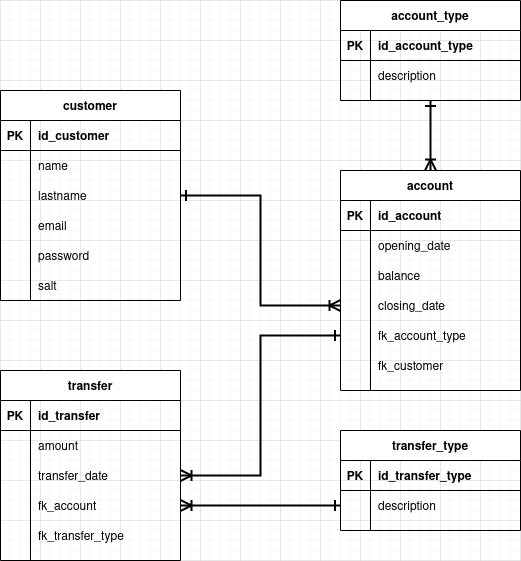

# qm95

  
  

A banking system with C# and SQLite.

ER diagram:

  

Main options:
- Registration
- Login

After the user is logged in, the following options are available:
- Create a new account
- Close an account
- View all accounts
- Create a new transfer, i. e. deposit or withdraw
- View account transfers
